```mermaid
graph TB
    subgraph "UI Layer — pages/"
        HOME[HomePage<br/>Hero + Sections]
        DETAILS[DetailsPage<br/>Metadata + Episodes]
        WATCH[WatchScreen<br/>Stream Selection]
        PLAYER[PlayerScreen<br/>Video Playback]
        SEARCH[SearchPage<br/>Debounced Search]
        CATALOG[CatalogPage<br/>Infinite Scroll]
        SETTINGS[SettingsPage<br/>Addons + Glass Toggle]
    end
    subgraph "Content Domains"
        MANGA_UI[MangaPage<br/>Discovery + Continue Reading]
        MANGA_READER[MangaReaderPage<br/>Horizontal/Vertical + Zoom]
        AUDIOBOOK_UI[AudiobooksPage<br/>Search + Continue Listening]
        AUDIOBOOK_PLAYER[AudiobookPlayerScreen<br/>Torrent/Direct + Timer]
        MUSIC_UI[MusicPage<br/>Home/Search/Browse/Library]
    end
    subgraph "Service Layer — services/"
        ADDON[AddonManager<br/>Singleton Orchestrator]
        STREAM[StreamService<br/>Aggregates All Sources]
        TORRENT[TorrentStreamService<br/>libtorrent Engine]
        SCRAPER[ScraperManager<br/>9 Pluggable Scrapers]
        METADATA[MetadataService<br/>Stremio HTTP Client]
        MANGA_SVC[MangaService<br/>WeebCentral Scraper]
        AUDIO_SVC[AudiobookScraperService<br/>9-Source Aggregator]
        MUSIC_SVC[OctaveMusicService<br/>Streaming API]
        SUBTITLE[SubtitleService<br/>Subdl Provider]
        BEST[BestSimilarScraper<br/>Recommendations]
    end
    subgraph "External"
        STREMIO[Stremio Addons<br/>Community Catalogs]
        VOD[VOD Sources<br/>VidSrc, FlyStream, etc.]
        DHT[BitTorrent DHT<br/>Peer-to-Peer]
        OCTAVE[Octave API<br/>Music Streaming]
        WEEB[WeebCentral<br/>Manga Database]
        WP[WordPress Sites<br/>Audiobook Hosts]
        ABBAY[AudiobookBay<br/>Torrent Index]
    end
    HOME --> DETAILS --> WATCH --> PLAYER
    HOME --> SEARCH & CATALOG & SETTINGS
    HOME --> MANGA_UI --> MANGA_READER
    HOME --> AUDIOBOOK_UI --> AUDIOBOOK_PLAYER
    HOME --> MUSIC_UI
    ADDON --> METADATA --> STREMIO
    STREAM --> SCRAPER & ADDON
    SCRAPER --> VOD
    TORRENT --> DHT
    MANGA_SVC --> WEEB
    AUDIO_SVC --> WP & ABBAY
    MUSIC_SVC --> OCTAVE
    SUBTITLE --> SUBTITLE
    BEST --> BEST
```

<p align="center">
  
</p>
<p align="center">
  <h1 align="center">PlayTorrio V3</h1>
  <h2 align="center"><em>All-in-One Media Streaming — Movies, Series, Manga, Audiobooks, and Music</em></h2>
</p>

<p align="center" style="font-size: 120%;">
  PlayTorrio V3 is a Flutter-powered universal media hub that aggregates streaming content from the open web, torrent networks, and Stremio-compatible addons into a single, beautifully designed interface. Browse catalogs from community addons. Stream movies and TV shows via direct VOD links or native BitTorrent with <code>libtorrent</code>. Read manga chapter-by-chapter with progress tracking. Listen to audiobooks streamed from torrents or nine independent sources. Play music through the Octave streaming API with full playlist and library management. Download subtitles on-demand from Subdl. From the hero carousel to the final credits — one app, every format, zero subscriptions.
</p>

<br/>

<p align="center">
  <b>9 VOD Scrapers</b> &nbsp;&middot;&nbsp; <b>Torrent Streaming Engine</b> &nbsp;&middot;&nbsp; <b>Stremio Addon Protocol</b> &nbsp;&middot;&nbsp; <b>9 Audiobook Sources</b> &nbsp;&middot;&nbsp; <b>Manga Reader</b> &nbsp;&middot;&nbsp; <b>Music Streaming</b>
  <br/>
  <b>Subtitle Download</b> &nbsp;&middot;&nbsp; <b>Glassmorphism UI</b> &nbsp;&middot;&nbsp; <b>5-Platform Support</b> &nbsp;&middot;&nbsp; <b>Responsive Layout</b> &nbsp;&middot;&nbsp; <b>Progress Persistence</b>
  <br/>
  
  
  
  
  
  
</p>

<br/>

<p align="center">
  <em>Movies: Stremio addon catalogs >> 9 VOD scrapers + torrent streaming >> subtitle download.<br/>Manga: WeebCentral browsing >> chapter reader with zoom >> persistent progress.<br/>Audiobooks: 9-source aggregation >> torrent or direct stream >> sleep timer.<br/>Music: Octave API >> full library management >> playlist + queue system.</em>
</p>

<br/>

<h2 align="center">Table of Contents</h2>

<p align="center">
  <a href="#who-is-this-for">Who Is This For?</a> &nbsp;&middot;&nbsp;
  <a href="#quick-start">Quick Start</a> &nbsp;&middot;&nbsp;
  <a href="#architecture">Architecture</a> &nbsp;&middot;&nbsp;
  <a href="#movie--tv-streaming">Movie &amp; TV</a> &nbsp;&middot;&nbsp;
  <a href="#vod-scrapers">VOD Scrapers</a> &nbsp;&middot;&nbsp;
  <a href="#torrent-streaming-engine">Torrent Engine</a> &nbsp;&middot;&nbsp;
  <a href="#stremio-addon-system">Addon System</a> &nbsp;&middot;&nbsp;
  <a href="#manga-reader">Manga</a> &nbsp;&middot;&nbsp;
  <a href="#audiobooks">Audiobooks</a> &nbsp;&middot;&nbsp;
  <a href="#music-streaming">Music</a> &nbsp;&middot;&nbsp;
  <a href="#subtitles">Subtitles</a> &nbsp;&middot;&nbsp;
  <a href="#ui--design">UI &amp; Design</a> &nbsp;&middot;&nbsp;
  <a href="#platform-support">Platforms</a> &nbsp;&middot;&nbsp;
  <a href="#project-structure">Structure</a> &nbsp;&middot;&nbsp;
  <a href="#configuration">Configuration</a> &nbsp;&middot;&nbsp;
  <a href="#maintainers">Maintainers</a>
</p>

<br/>

> **LEGAL DISCLAIMER**: PlayTorrio V3 is an aggregator and media player. It does not host, store, or distribute copyrighted content. All content is sourced from publicly available third-party services, community addons, and user-provided sources. Users are solely responsible for ensuring they have the legal right to access content in their jurisdiction. This software is provided for educational and research purposes. The developers do not endorse piracy or copyright infringement.

<br/>

---

<h2 align="center">Who Is This For?</h2>

<table>
<tr>
<td width="25%" valign="top">

### Cord-Cutters
Stop juggling six different apps and subscription services. PlayTorrio brings together movies, TV, manga, audiobooks, and music under one roof. Browse catalogs from community-maintained Stremio addons, stream from multiple VOD sources, or torrent directly in-app. One interface. Every format. No monthly fees.

</td>
<td width="25%" valign="top">

### Manga Readers
Read manga with a dedicated reader that remembers exactly where you left off. Browse WeebCentral's entire catalog — manga, manhwa, and manhua — with genre filtering, chapter search, and pagination. Switch between horizontal swipe and vertical scroll modes. Zoom into artwork detail. Your reading progress syncs across sessions so you never lose your place.

</td>
<td width="25%" valign="top">

### Audiobook Listeners
Access audiobooks from nine independent sources aggregated in parallel. Stream chapters directly or torrent the full book with selective file downloading. Adjust playback speed from 1.0x to 2.0x. Set a sleep timer. Your listening position is saved every five seconds — pick up exactly where you stopped, even across app restarts.

</td>
<td width="25%" valign="top">

### Tinkerers & Self-Hosters
PlayTorrio is built on open protocols. The Stremio addon system means you can point it at your own self-hosted metadata server. The scraper architecture is fully pluggable — write a new scraper by implementing a single abstract class. Torrent streaming uses native `libtorrent` bindings with full control over connection limits, cache size, and file selection. Everything is Dart. Everything is modifiable.

</td>
</tr>
</table>

<br/>

---

<h2 align="center">Quick Start</h2>

### Prerequisites

| Requirement | Details |
|:------------|:--------|
| **Flutter SDK** | 3.x or later (Dart 3.11.5+) |
| **Platform** | macOS, Windows, Linux, iOS, Android |
| **Optional** | Xcode (iOS/macOS builds), Android Studio (Android builds) |

```bash
git clone https://github.com/ayman708-UX/PlayTorrioV3.git
cd PlayTorrioV3
flutter pub get
flutter run
```

| Target | Command | Notes |
|:-------|:--------|:------|
| **macOS** | `flutter run -d macos` | Native desktop app |
| **iOS** | `flutter run -d ios` | Requires Xcode + iOS Simulator or device |
| **Android** | `flutter run -d android` | Requires Android SDK + emulator or device |
| **Linux** | `flutter run -d linux` | Native Linux desktop |
| **Windows** | `flutter run -d windows` | Native Windows desktop |
| **Web** | `flutter run -d chrome` | Experimental — some native plugins unsupported |

On first launch, the app automatically installs the default Cinemeta addon and initializes the torrent streaming engine. No additional configuration is required to start browsing.

---

<h2 align="center">Architecture</h2>



<p align="center">
  <em>The app is organized into three layers: UI pages that render content, a service layer that orchestrates data flow, and external sources that provide the actual media. Services are singletons — initialized once at startup, accessible anywhere. The scraper system uses a plugin architecture: each scraper extends <code>StreamScraper</code> and registers with the <code>ScraperManager</code>, which runs all scrapers concurrently and deduplicates results.</em>
</p>

<br/>

---

<h2 align="center">Movie &amp; TV Streaming</h2>

<p align="center">
  <b>Stremio Addon Catalogs</b> &nbsp;&middot;&nbsp; <b>Genre Browsing</b> &nbsp;&middot;&nbsp; <b>Infinite Scroll</b> &nbsp;&middot;&nbsp; <b>Season/Episode Navigation</b> &nbsp;&middot;&nbsp; <b>9 VOD Scrapers</b> &nbsp;&middot;&nbsp; <b>Torrent Streaming</b> &nbsp;&middot;&nbsp; <b>"More Like This"</b>
</p>

<p align="center">
  <em>The movie and TV pipeline is the heart of PlayTorrio. Content discovery flows from community addon catalogs through metadata enrichment to multi-source stream aggregation — all happening concurrently so the user sees results as soon as they arrive.</em>
</p>

### Discovery Pipeline

```
Addon Catalog >> Metadata Enrichment >> Stream Aggregation >> Playback
     |                  |                       |
  Cinemeta          BestSimilar           9 Scrapers
  Community         Recommendations       Torrent DHT
  Custom URLs       Cast + Genres         Subtitle Fetch
```

### Home Screen

The landing page features a hero carousel showcasing featured titles pulled from all installed addons, with intelligent deduplication to ensure visual diversity. Below the hero, horizontally scrollable sections stream in progressively as each addon returns its catalogs. Every section is labeled with catalog name, content type, and source addon. Pull-to-refresh reloads everything. A glass-bottom navigation dock provides one-tap access to Manga, Audiobooks, and Music sections.

### Detail Pages

Tapping any poster navigates to a full detail page with:
- **Backdrop image** with gradient overlay for readability
- **Metadata header** — title, year, IMDb rating, runtime, director, cast
- **Expandable synopsis** with animated height transition
- **Genre tags** rendered as tappable chips
- **Cast row** with horizontal scrolling
- **Season selector** with episode grid and quick-scroll buttons
- **"More Like This"** section powered by the BestSimilar recommendation engine
- **Links section** for external trailers, IMDb pages, and related content

### Stream Selection

The Watch Screen queries all available sources in parallel — nine built-in VOD scrapers plus every installed Stremio addon. Results stream in progressively, batched at 60ms intervals to avoid UI jank. Each stream source displays:
- **Quality badge** — 4K, 1080p, 720p, or 480p detected from title metadata
- **Codec tag** — HEVC, H.264, AV1
- **HDR indicator** — Dolby Vision, HDR10+, HDR
- **File size** — parsed and formatted from torrent metadata
- **Source label** — which scraper or addon provided the stream
- **Type indicator** — direct VOD URL or torrent magnet link

Streams are sorted by quality rank (4K > 1080p > 720p > 480p) with same-quality ties broken alphabetically. An addon filter dropdown lets users focus on specific sources. Desktop and mobile layouts adapt responsively. Tapping a stream navigates to the full-screen player via a cinematic slide transition.

### Video Player

The player screen is immersive and landscape-oriented. Built on `video_player` with `fvp` (FFmpeg Video Player) for broad codec support. Features include:
- **Auto-hiding controls** — tap to reveal, auto-dismiss after inactivity
- **Subtitle overlay** — load external SRT/VTT with adjustable delay and scale
- **Playback speed** — variable rate control
- **Video fit toggle** — cover, contain, fill modes
- **Volume control** with mute toggle
- **Torrent health display** — active peers, download speed, cache percentage

For torrent streams, the player shows real-time libtorrent statistics so users can monitor swarm health during playback.

<br/>

---

<h2 align="center">VOD Scrapers</h2>

<p align="center">
  <b>9 Scrapers</b> &nbsp;&middot;&nbsp; <b>Plugin Architecture</b> &nbsp;&middot;&nbsp; <b>Concurrent Execution</b> &nbsp;&middot;&nbsp; <b>Automatic Deduplication</b> &nbsp;&middot;&nbsp; <b>Dual Providers</b>
</p>

<p align="center">
  <em>Each scraper is an independent module that implements a common interface. The ScraperManager runs all nine concurrently, collects results, and deduplicates by info-hash. Adding a new source is a matter of extending one abstract class and registering it.</em>
</p>

### Scraper Registry

<table>
<tr><th>#</th><th>Scraper</th><th>Type</th><th>Provider</th><th>Description</th></tr>
<tr><td>1</td><td><b>FlyStream</b></td><td>Direct VOD</td><td>PlayTorrioHTTP</td><td>High-speed HLS streams with quality/codec metadata. Simple API with random viewer ID generation.</td></tr>
<tr><td>2</td><td><b>Videasy</b></td><td>Direct VOD</td><td>PlayTorrioHTTP</td><td>Multi-CDN HLS extractor. Uses RC4-style sbox decryption to unlock API responses. Queries five different providers (Yoru, Neon, Breach, Killjoy, Omen).</td></tr>
<tr><td>3</td><td><b>VidSrc</b></td><td>Direct VOD</td><td>PlayTorrioHTTP</td><td>Dual-strategy: queries API first, falls back to scraping embed page for m3u8 URLs. TMDB ID resolution for accurate matching.</td></tr>
<tr><td>4</td><td><b>MultiEmbed</b></td><td>Direct VOD</td><td>PlayTorrioHTTP</td><td>2embed.cc multi-server extractor. Parses server dropdown, follows XPS chain (xpass.top >> playlist.json >> m3u8 URLs).</td></tr>
<tr><td>5</td><td><b>VidCore</b></td><td>Direct VOD</td><td>PlayTorrioHTTP</td><td>Multi-server VOD extractor with skip-based pagination to discover all available servers. Handles nested source structures.</td></tr>
<tr><td>6</td><td><b>4KHDHub</b></td><td>Direct VOD</td><td>PlayTorrioHTTP</td><td>4K-focused direct stream source. Resolves obfuscated redirect chains (base64 + ROT13 cipher). Validates stream health with HEAD request before returning.</td></tr>
<tr><td>7</td><td><b>XDownloader</b></td><td>Direct VOD</td><td>PlayTorrioHTTP</td><td>Films365/All Movies Downloader API. Bearer token authentication. Handles movies (direct download) and TV (season >> episode navigation).</td></tr>
<tr><td>8</td><td><b>Knaben</b></td><td>Torrent</td><td>PlayTorrio</td><td>knaben.org meta-search. HTML table parsing with exact title matching. Uses ParseTorrentTitle for season/episode filtering.</td></tr>
<tr><td>9</td><td><b>Torrent Galaxy</b></td><td>Torrent</td><td>PlayTorrio</td><td>torrentgalaxy.info search. Two-phase: list page search then concurrent detail page fetching for magnet links.</td></tr>
</table>

### Scraper Architecture

```dart
abstract class StreamScraper {
  String get name;
  Future<List<StreamSource>> scrape({
    required String type,        // 'movie' or 'series'
    required String title,       // Exact title for matching
    required int? year,          // Release year for disambiguation
    required int? season,        // TV season number
    required int? episode,       // TV episode number
    required String? imdbId,     // IMDb ID for TMDB lookup
  });
}
```

Each scraper implements this interface. The `ScraperManager` singleton maintains a registry, runs all scrapers via `Future.wait`, and deduplicates results by info-hash. A TMDB helper utility resolves IMDb IDs to TMDB IDs for scrapers that need them. Results are cached with LRU eviction. Failed scrapers are silently skipped — one broken source never blocks the others.

**Providers:**
- **PlayTorrioHTTP** — Direct VOD scrapers that return HTTP/HTTPS stream URLs (m3u8, mp4)
- **PlayTorrio** — Torrent scrapers that return magnet links and info-hashes, which feed into the torrent streaming engine

<br/>

---

<h2 align="center">Torrent Streaming Engine</h2>

<p align="center">
  <b>Native libtorrent</b> &nbsp;&middot;&nbsp; <b>Selective File Download</b> &nbsp;&middot;&nbsp; <b>Intelligent File Selection</b> &nbsp;&middot;&nbsp; <b>Real-Time Stats</b> &nbsp;&middot;&nbsp; <b>HTTP Stream Output</b>
</p>

<p align="center">
  <em>PlayTorrio embeds a full BitTorrent client via <code>libtorrent_flutter</code> — native C++ libtorrent bindings compiled for each platform. Torrents are streamed sequentially: the engine prioritizes pieces needed for immediate playback while continuing to download the rest in the background.</em>
</p>

### Engine Configuration

| Parameter | Value | Description |
|:----------|:------|:------------|
| Max connections | 200 | Simultaneous peer connections |
| Cache size | Dynamic | Memory-mapped, OS-managed |
| Listen ports | OS-assigned | Random available ports |
| DHT | Enabled | Mainline DHT for peer discovery |
| LSD | Enabled | Local Service Discovery |
| uTP | Enabled | Micro Transport Protocol |

### File Selection Algorithm

When a multi-file torrent is loaded (common for TV season packs), the engine applies a smart selection strategy:

1. **Parse all filenames** using the `ParseTorrentTitle` utility — extract season, episode, resolution, codec, and audio metadata from raw torrent filenames
2. **Match by season/episode** if the user requested a specific episode — filters to files whose parsed metadata matches the target season and episode numbers
3. **Filter by media extension** — only considers files with video extensions: `.mp4`, `.mkv`, `.avi`, `.webm`, `.mov`, `.wmv`, `.flv`, `.ts`, `.m2ts`
4. **Fallback to largest file** — if no episode match is found, selects the largest media file by byte size (typically the full movie)
5. **Return file index** — passes the selected file's index to libtorrent for prioritized piece download

### Real-Time Statistics

The engine exposes a `statsStream` that emits `TorrentStats` updates during playback:

| Stat | Unit | Description |
|:-----|:-----|:------------|
| Download speed | Mbps/Kbps | Current peer download rate |
| Upload speed | Mbps/Kbps | Current upload contribution |
| Active peers | Count | Connected and transferring peers |
| Total peers | Count | All known peers in swarm |
| Cache progress | Percentage | Pieces buffered vs total |
| Total progress | Bytes | Downloaded vs total torrent size |
| Connection state | Enum | stopped, starting, ready, error |

### Engine Lifecycle

```
initialize() >> start() >> streamTorrent(magnet) >> [playback] >> cleanup()
                  |              |                        |
            Configures       Adds magnet,           Removes torrent,
            libtorrent       waits metadata,        frees resources
            settings         selects file,
                             starts HTTP stream
```

The engine is a singleton. Multiple torrents can be active simultaneously — each keyed by its info-hash. Disposed torrent IDs are tracked to prevent double-dispose crashes. The engine properly shuts down on app termination.

<br/>

---

<h2 align="center">Stremio Addon System</h2>

<p align="center">
  <b>Community Catalogs</b> &nbsp;&middot;&nbsp; <b>Metadata Enrichment</b> &nbsp;&middot;&nbsp; <b>Concurrent Search</b> &nbsp;&middot;&nbsp; <b>Relevance Scoring</b> &nbsp;&middot;&nbsp; <b>Progressive Loading</b>
</p>

<p align="center">
  <em>PlayTorrio is a fully functional Stremio client. It speaks the Stremio addon protocol natively — fetching manifests, browsing catalogs, searching content, and loading metadata from any community addon URL. The addon manager is the central orchestrator for all movie and TV content discovery.</em>
</p>

### Addon Manager (Singleton)

The `AddonManager` is the first service initialized at startup and the backbone of content discovery:

| Operation | Description |
|:----------|:------------|
| `initialize()` | Loads installed addons from SharedPreferences. Auto-installs Cinemeta if no addons configured. |
| `addAddon(url)` | Fetches manifest from URL, validates it, deduplicates by ID, saves to persistent storage. |
| `removeAddon(id)` | Removes addon and clears associated caches. |
| `toggleAddon(id, enabled)` | Enables/disables without uninstalling — filtered at query time. |
| `fetchAllHomeSections()` | Aggregates all catalogs from all enabled addons into `MovieSection` objects. Returns as a stream — sections render progressively as each addon responds. |
| `searchAll(query)` | Searches across all enabled addons concurrently. Results are relevance-scored and sorted before display. |
| `fetchByGenre(genre)` | Filters catalogs by genre tag across all enabled addons. |

### Content Flow

```
User installs addon URL
        |
        v
AddonManager fetches /manifest.json
        |
        v
Parses AddonManifest (id, name, version, resources, catalogs, types)
        |
        v
Stores InstalledAddon (baseUrl + manifest + enabled flag)
        |
        v
On home screen load: AddonManager.fetchAllHomeSections()
        |
        v
For each addon catalog: MetadataService.fetchCatalog()
        |
        v
HTTP GET {baseUrl}/catalog/{type}/{catalogId}.json
        |
        v
Parse response into List<Movie> with poster, year, type metadata
        |
        v
Wrap in MovieSection (title, subtitle, contentType, addon source)
        |
        v
Stream to UI — each section renders as it arrives
```

### Search Architecture

Searches execute concurrently across all enabled addons. Each addon's results are scored by the `RelevanceScorer` using exact-match-first ranking:

```
Query: "Breaking Bad"
        |
        v
Addon 1 search >> [{title: "Breaking Bad", score: 10000}, ...]
Addon 2 search >> [{title: "Better Call Saul", score: 5000}, ...]
Addon 3 search >> [{title: "Breaking Bad S05", score: 10000}, ...]
        |
        v
Merge + Sort by score descending
        |
        v
Display sectioned by addon source
```

The relevance scorer strips leading articles ("the", "a", "an"), normalizes to lowercase alphanumeric, and applies tiered bonuses: exact match (10,000), substring match (5,000), prefix match (3,000). Multi-word queries are capped if not all tokens match.

### Built-in Defaults

The Cinemeta addon is pre-configured and installed automatically on first launch. It provides the baseline movie and series catalog. Users can add any Stremio-compatible community addon — Torrentio, Orion, KnightCrawler, self-hosted servers, or private instances — by pasting the manifest URL in Settings.

<br/>

---

<h2 align="center">Manga Reader</h2>

<p align="center">
  <b>WeebCentral Integration</b> &nbsp;&middot;&nbsp; <b>Horizontal &amp; Vertical Modes</b> &nbsp;&middot;&nbsp; <b>Pinch-to-Zoom</b> &nbsp;&middot;&nbsp; <b>Reading Progress</b> &nbsp;&middot;&nbsp; <b>Chapter Search</b> &nbsp;&middot;&nbsp; <b>Adult Content Toggle</b>
</p>

<p align="center">
  <em>A full-featured manga reading experience built on WeebCentral's web catalog. Browse, search, read, and track progress — all within the app, all persisted across sessions.</em>
</p>

### Discovery

The manga page offers two browsing modes:
- **Browse** — infinite-scroll grid of manga covers with genre tag filtering. Content loads in pages, with smooth loading indicators between fetches.
- **Search** — debounced text search across WeebCentral's catalog with paginated results.

A "Continue Reading" section at the top shows your reading history — the manga you've started, sorted by most recently read, with progress indicators on each card. This section persists via `SharedPreferences` and survives app restarts.

### Detail Page

Each manga has a detail page displaying:
- **Hero cover image** with gradient overlay transitioning to the metadata section
- **Metadata** — title, type (Manga/Manhwa/Manhua), status (Ongoing/Completed), year, author, tags
- **Synopsis** — full description parsed from WeebCentral's left sidebar layout
- **Chapter list** — paginated at 50 chapters per page, with page navigation controls
- **Chapter search** — filter chapters by number or name
- **Reading progress** — which chapter you last read, displayed with a visual indicator

### Reader

The reader page is the core manga experience. Images load from WeebCentral's CDN (`temp.compsci88.com`) with caching for offline-like performance:

| Feature | Detail |
|:--------|:-------|
| **Horizontal mode** | PageView with swipe navigation — one page at a time, full-screen |
| **Vertical mode** | Continuous scroll — all images in a column, natural reading flow |
| **Zoom** | Pinch-to-zoom with `InteractiveViewer`. Double-tap to reset. Min scale 1.0x, max 3.0x |
| **Chapter navigation** | Previous/next chapter buttons. Auto-advances to next chapter at end |
| **Progress saving** | Current page and chapter saved on navigation and periodically during reading |
| **Immersive UI** | Overlay auto-hides. Tap to reveal controls. Keyboard focus-aware |
| **Image pre-caching** | `CachedNetworkImage` pre-loads adjacent pages for smooth swiping |

### Progress Persistence

Reading progress is tracked with `ValueNotifier<int>` for reactive UI updates. Each manga's current chapter and page are stored in `SharedPreferences` via the `MangaService`. The history is capped to prevent bloat. The static cache on the manga discovery page preserves state across tab navigations — switching to Movies and back keeps your scroll position and loaded content.

<br/>

---

<h2 align="center">Audiobooks</h2>

<p align="center">
  <b>9 Independent Sources</b> &nbsp;&middot;&nbsp; <b>Torrent &amp; Direct Streaming</b> &nbsp;&middot;&nbsp; <b>Variable Speed</b> &nbsp;&middot;&nbsp; <b>Sleep Timer</b> &nbsp;&middot;&nbsp; <b>Progress Persistence</b> &nbsp;&middot;&nbsp; <b>Chapter Navigation</b>
</p>

<p align="center">
  <em>Nine audiobook sources searched in parallel, with results merged and relevance-ranked. Stream directly from WordPress-hosted audio files or torrent the full audiobook with selective chapter downloading. Every listening session is tracked and resumed exactly where you left off.</em>
</p>

### Source Aggregation

All nine sources are queried simultaneously with a 5-second timeout per source. Results are merged and sorted by relevance score:

| # | Source | Domain | Type |
|:-:|:-------|:-------|:-----|
| 1 | **AudiobookBay** | `audiobookbay.lu` | Torrent index — magnet links with file lists |
| 2 | **GoldenAudiobooks** | `goldenaudiobooks.com` | WordPress — direct audio URLs |
| 3 | **FullLengthAudiobooks** | `fulllengthaudiobooks.com` | WordPress — direct audio URLs |
| 4 | **HotAudiobooks** | `hotaudiobooks.com` | WordPress — direct audio URLs |
| 5 | **BookAudiobooks** | `bookaudiobooks.com` | WordPress — direct audio URLs |
| 6 | **Audiozaic** | `audiozaic.com` | WordPress — direct audio URLs |
| 7 | **AudioAZ** | `audioaz.com` | WordPress — direct audio URLs |
| 8 | **Audiobooks4Soul** | `audiobooks4soul.com` | WordPress — direct audio URLs |
| 9 | **Audionest** | `search.audionestapp.com` | Meilisearch API — Firebase anonymous auth |

### Discovery Page

The audiobooks page defaults to a "Harry Potter" search on first load — demonstrating the aggregation capabilities immediately. Features include:
- **Search** — debounced text search with relevance-scored results from all nine sources
- **"Continue Listening"** — horizontal carousel of in-progress audiobooks sorted by last listened timestamp
- **Results grid** — audiobook cards with cover art, title, source badge, and tap-to-detail navigation

### Detail & Chapter List

Each audiobook has:
- **Backdrop blur** cover image with ambient background glow
- **Source badge** — torrent (magnet icon) or stream (play icon)
- **Metadata** — title, author, source information
- **Chapter list** — all chapters with tap-to-play. Source-specific chapter extraction (each WordPress site has unique HTML structure; AudiobookBay returns torrent file lists).

### Player

The audiobook player handles two fundamentally different streaming modes:

**Direct Stream:**
- Standard HTTP audio streaming from WordPress sites
- Chapter-by-chapter playback with URL-based navigation
- No download required — plays immediately

**Torrent Stream:**
- Magnet link resolved through the torrent engine
- Selective file downloading — the engine identifies audio files (`.mp3`, `.m4b`, `.m4a`, `.ogg`, `.flac`) from the torrent file list
- Chapters map to individual torrent files via file index
- Sequential streaming with piece prioritization

**Player Features:**

| Feature | Detail |
|:--------|:-------|
| **Playback speed** | 1.0x, 1.25x, 1.5x, 1.75x, 2.0x |
| **Chapter navigation** | Previous/next buttons with label display |
| **Progress saving** | Position saved every 5 seconds to SharedPreferences |
| **Sleep timer** | Configurable auto-stop: 15min, 30min, 45min, 60min, or end of chapter |
| **Seek bar** | Draggable position slider with time labels |
| **Volume control** | Independent volume with mute toggle |
| **Visual** | Spinning disc animation during playback |
| **Transition** | Custom zoom+fade+slide route transition into and out of the player |

### Progress Persistence

Audiobook progress is stored as a JSON-encoded list in `SharedPreferences`, limited to 20 entries to prevent storage bloat. Each entry records: audiobook UUID, current chapter index, playback position in seconds, and timestamp of last listen. Entries are sorted by last listened — the most recent is always at the top of "Continue Listening."

<br/>

---

<h2 align="center">Music Streaming</h2>

<p align="center">
  <b>Octave Streaming API</b> &nbsp;&middot;&nbsp; <b>Search &amp; Browse</b> &nbsp;&middot;&nbsp; <b>Library Management</b> &nbsp;&middot;&nbsp; <b>Playlists</b> &nbsp;&middot;&nbsp; <b>Quality Switching</b> &nbsp;&middot;&nbsp; <b>Keyboard Shortcuts</b> &nbsp;&middot;&nbsp; <b>Queue System</b>
</p>

<p align="center">
  <em>A complete music streaming experience powered by the Octave API. Browse curated sections, search across tracks/artists/albums, build playlists, like tracks, and manage a personal library — all with a persistent mini-player and full-screen playback view.</em>
</p>

### Octave Integration

| Endpoint | Purpose |
|:---------|:--------|
| `api.octavestreaming.com/api/playback-token` | Fetch authenticated streaming token |
| `music.octavestreaming.com/api/search?q={query}` | Search tracks, artists, albums |
| `api.octavestreaming.com/audio/{quality}?track={id}&token={token}` | Direct audio stream (lossless/320/128) |
| `music.octavestreaming.com/api/artist/{id}` | Artist details, top tracks, albums, related |
| `music.octavestreaming.com/api/playlist/{id}` | Playlist details with track listing |

### Tabbed Interface

The music page uses four tabs:

| Tab | Content |
|:----|:--------|
| **Home** | Curated sections — trending tracks, new releases, featured artists, recommended playlists. Sections load progressively as API responses arrive. |
| **Search** | Debounced text search with results grouped by type: tracks, artists, albums, playlists. Tap any result to play or explore further. |
| **Browse** | Trending artists grid with cover images. Tap to view artist detail modal with top tracks, albums, and related artists. |
| **Library** | Personal collection: liked tracks list, user-created playlists with track counts, recently played history. |

### Player Controller

The `MusicPlayerController` singleton manages all playback state:

| Feature | Detail |
|:--------|:-------|
| **Playlist management** | Queue system — play now, play next, add to queue |
| **Quality switching** | Lossless, 320kbps, 128kbps — toggle mid-playback |
| **Play/pause/seek** | Standard transport controls |
| **Track navigation** | Next track (auto-advance), previous track (skip back if >4s into current track) |
| **Volume** | Independent volume control |
| **Shuffle** | Random queue order |
| **Repeat** | Off / Queue / Single track |
| **Like** | Heart toggle synced to library |

### Library Persistence

The `OctaveLibraryService` (also a singleton `ChangeNotifier`) persists liked tracks and custom playlists to `SharedPreferences` as JSON. Operations include: toggle like, create/delete playlist, add/remove track from playlist. The library survives app restarts and is reactive — any UI listening to the service updates automatically when tracks are liked or playlists are modified.

### Mini-Player & Full Player

A persistent mini-player bar sits at the bottom of the music page showing current track art, title, artist, and play/pause button. Tapping it expands to the full-screen player with:
- **Album art** with dominant color extraction for background ambiance
- **Track info** — title, artist, album
- **Seek bar** with elapsed/remaining time
- **Transport controls** — previous, play/pause, next, shuffle, repeat, like
- **Queue drawer** — slide-up panel showing upcoming tracks with drag-to-reorder
- **Lyrics drawer** — synced lyrics display (when available from Octave)
- **Quality indicator** — current streaming bitrate

### Keyboard Shortcuts

| Key | Action |
|:----|:-------|
| `Space` | Play / Pause |
| `J` | Seek backward 10s |
| `L` | Seek forward 10s |
| `M` | Mute / Unmute |
| `Q` | Toggle queue drawer |
| `F` | Toggle full-screen |
| `/` | Show shortcuts overlay |

<br/>

---

<h2 align="center">Subtitles</h2>

<p align="center">
  <b>Subdl Provider</b> &nbsp;&middot;&nbsp; <b>Multi-Language</b> &nbsp;&middot;&nbsp; <b>TV Season/Episode Matching</b> &nbsp;&middot;&nbsp; <b>ZIP Extraction</b> &nbsp;&middot;&nbsp; <b>SRT/VTT Parsing</b> &nbsp;&middot;&nbsp; <b>Pluggable Providers</b>
</p>

<p align="center">
  <em>Subtitles are fetched on-demand when entering the video player. The subtitle service queries all registered providers concurrently, groups results by language, and downloads/extracts the selected subtitle file to a local temp directory for the video player to render.</em>
</p>

### Subtitle Architecture

```
Player Screen opens
        |
        v
SubtitleService.fetchAllSubtitles(movieName, imdbId?, season?, episode?)
        |
        v
All providers queried concurrently
        |
        v
Results grouped by language >> List<SubtitleLanguageGroup>
        |
        v
User selects variant >> SubtitleService.downloadSubtitle(variant)
        |
        v
SubtitleExtractor downloads ZIP >> extracts SRT/VTT >> returns local path
        |
        v
Player loads subtitle file with delay/scale adjustment
```

### Subdl Provider

The Subdl provider searches for subtitles by movie name and optionally filters by IMDb ID for precision. For TV shows, it matches season and episode numbers against Subdl's structured metadata. Downloaded subtitles arrive as ZIP archives and are extracted to a temporary directory. Both SRT and VTT formats are supported.

### Provider Interface

```dart
abstract class SubtitleProvider {
  Future<List<SubtitleVariant>> search({
    required String movieName,
    String? imdbId,
    int? season,
    int? episode,
  });
  
  Future<String> download(SubtitleVariant variant);
}
```

New subtitle providers can be added by implementing this interface and registering with the `SubtitleService`. The service handles concurrent queries, language grouping, and deduplication automatically.

### Player Integration

In the video player, users can:
- **Select subtitle language** from the grouped list of available subtitles
- **Adjust subtitle delay** — shift timing forward or backward in 100ms increments
- **Adjust subtitle scale** — larger or smaller text rendering
- **Toggle subtitles** on/off during playback

Subtitles render via the native video player's text track support with the selected delay and scale applied.

<br/>

---

<h2 align="center">UI &amp; Design</h2>

<p align="center">
  <b>Glassmorphism</b> &nbsp;&middot;&nbsp; <b>Liquid Glass Effects</b> &nbsp;&middot;&nbsp; <b>Performance Toggle</b> &nbsp;&middot;&nbsp; <b>Custom Route Transitions</b> &nbsp;&middot;&nbsp; <b>Responsive Layout</b> &nbsp;&middot;&nbsp; <b>macOS-Style Dock</b>
</p>

<p align="center">
  <em>The visual identity of PlayTorrio is built on a custom glassmorphism design system with GPU-accelerated shader effects. Every surface has depth. Every transition is deliberate. And for devices that need it, a single toggle disables the expensive effects while preserving the aesthetic.</em>
</p>

### Glassmorphism System

The app uses the `liquid_glass_easy` package which applies real-time GPU shader effects including:
- **Frosted glass** — backdrop blur with dynamic intensity
- **Refraction simulation** — content appears to bend behind glass surfaces
- **Jelly deformation** — subtle elastic response to scroll and touch
- **Optical borders** — light-edge highlights that simulate physical glass thickness
- **Hover lensing** — magnification and distortion under the cursor on desktop

### Performance-Conscious Fallback

The `GlassSettings` service controls a global `ValueNotifier<bool>` toggle — "Full Liquid Glass." When enabled, all GPU shader effects are active for the premium experience. When disabled, the app falls back to lightweight gradient and blur approximations that preserve the visual intent without the GPU cost. Users can toggle this in Settings at any time. The toggle persists via `SharedPreferences`.

Key performance optimizations:
- **`RepaintBoundary`** — widget subtrees that don't need shader recomputation are isolated
- **Shader pre-warming** — a sweep animation on the dock pre-compiles GPU shaders before user interaction
- **`PerformanceLiquidLens`** — optimized shader presets for common patterns (dock, sheet, menu button, menu)
- **Fallback gradients** — when glass is disabled, styled gradients maintain the frosted look without shader overhead

### Custom Route Transitions

| Transition | Duration | Effect | Used For |
|:-----------|:---------|:-------|:---------|
| **LiquidRevealRoute** | 750ms | Circular mask expands from tap point revealing the new page beneath | Movie details, manga details, search, settings |
| **CinematicSlideRoute** | 600ms | Page slides up while fading in with a slight scale — cinematic entrance | Watch screen, player screen |
| **ZoomFadeSlide** | 400ms | Combines zoom-out + fade-out + slide-up — elegant exit | Audiobook player entrance |

### Liquid Dock

A macOS-style animated dock sits at the bottom of the home screen providing navigation to Manga, Audiobooks, and Music sections. Dock icons scale up with proximity to the cursor — a lens magnification effect. Arrow buttons appear when dock items overflow the available width. The dock pre-warms GPU shaders during its initial build to eliminate first-interaction jank.

### Responsive Card System

Movie and manga cards adapt to screen width through factory sizing classes:

```
Screen Width < 600px  >> Card width: 138px  (compact mobile)
Screen Width 600-900  >> Card width: ~155px (tablet)
Screen Width 900-1200 >> Card width: ~175px (small desktop)
Screen Width > 1200px >> Card width: 205px  (large desktop)
```

Cards feature hover animations — subtle lift with shadow expansion on mouse enter, return on exit. A shimmer loading skeleton (`PosterSkeleton`) displays while cover art loads. Missing posters fall back to an icon placeholder.

### Custom Scroll Track

A glass-styled scrollbar with:
- **Drag-to-scroll** thumb
- **Arrow buttons** at each end for incremental scroll
- **Magnetic snap** — thumb gravitates toward nearest position
- **Animated opacity** — visible on hover, fades when idle
- **Dual orientation** — vertical and horizontal variants

### Section Components

- **`SectionHeader`** — Title + optional subtitle + "See All" link that navigates to full catalog
- **`MovieSliderSection`** — Horizontal scrollable row with animated slide-in arrow buttons. Arrows appear on hover (desktop) or are always visible (mobile). Scrolls 80% of viewport width per arrow press.
- **`SliderArrow`** — Glass circle button with hover/press state animations

### Theme

```
Background: #080A0F (deep near-black with blue undertone)
Seed Color:  #7C5CFF (vibrant purple — used for accents, buttons, focus rings)
Surface:     Glass with 10-20% opacity over background
Text:        White primary, 70% opacity secondary
Brightness:  Dark (forced — no light mode)
Material:    Material 3 (latest Material Design spec)
```

Scroll overscroll effects are disabled globally for a clean, native-feeling scroll experience. The debug banner is suppressed. The app runs in immersive sticky mode — system UI (status bar, navigation bar) auto-hides for full-screen content consumption.

<br/>

---

<h2 align="center">Platform Support</h2>

<table>
<tr><th>Platform</th><th>Status</th><th>Notes</th></tr>
<tr><td><b>macOS</b></td><td>Full support</td><td>Native desktop app. All features including torrent streaming and glassmorphism GPU effects. Primary development target.</td></tr>
<tr><td><b>iOS</b></td><td>Full support</td><td>Includes libass native framework for ASS/SSA subtitle rendering. All scrapers and streaming work.</td></tr>
<tr><td><b>Android</b></td><td>Full support</td><td>Min SDK 21 (Android 5.0). All features functional.</td></tr>
<tr><td><b>Linux</b></td><td>Full support</td><td>Native Linux desktop via GTK embedding. Torrent engine compiled for Linux.</td></tr>
<tr><td><b>Windows</b></td><td>Full support</td><td>Native Win32 desktop. All features functional.</td></tr>
<tr><td><b>Web</b></td><td>Experimental</td><td>Runs in Chrome but native plugins (libtorrent, fvp, libass) are unavailable. Limited to direct VOD streaming and metadata browsing.</td></tr>
</table>

<br/>

---

<h2 align="center">Project Structure</h2>

```
PlayTorrioV3/
├── lib/
│   ├── main.dart                          # App entry point — engine init, addon boot, theme
│   ├── models/
│   │   ├── addon/addon.dart               # AddonManifest, InstalledAddon
│   │   ├── movie/movie.dart               # Movie catalog item
│   │   ├── movie/movie_detail.dart        # Full metadata (cast, genres, rating, runtime)
│   │   ├── movie/video.dart               # Episode/season video
│   │   ├── movie/link.dart                # External links (IMDb, trailers)
│   │   ├── movie/movie_section.dart       # Grouped catalog section
│   │   ├── stream/stream_model.dart       # Playable stream source with quality detection
│   │   ├── subtitle/subtitle_model.dart   # SubtitleVariant, SubtitleLanguageGroup
│   │   ├── manga/manga.dart               # Manga metadata
│   │   ├── manga/manga_chapter.dart       # Chapter with number parsing
│   │   ├── audiobook/audiobook_model.dart # Audiobook + AudiobookChapter
│   │   └── music/music_track.dart         # MusicTrack, MusicArtist, MusicAlbum, Playlist
│   ├── services/
│   │   ├── glass_settings.dart            # Global glass effects toggle (ValueNotifier + SharedPreferences)
│   │   ├── addon/addon_manager.dart       # Central orchestrator — install, search, catalog aggregation
│   │   ├── metadata/metadata_service.dart # Stremio HTTP client (manifest, catalog, search, meta)
│   │   ├── metadata/bestsimilar_scraper.dart  # "More Like This" recommendation engine
│   │   ├── stream/stream_service.dart     # Aggregates streams from scrapers + addons
│   │   ├── stream/torrent_stream_service.dart # Native libtorrent engine — magnet >> HTTP stream
│   │   ├── scraper/stream_scraper.dart    # Abstract base class + ScraperManager registry
│   │   ├── scraper/sites/
│   │   │   ├── flystream.dart             # FlyStream VOD scraper
│   │   │   ├── videasy.dart               # Videasy multi-CDN scraper (encrypted API)
│   │   │   ├── vidsrc.dart                # VidSrc dual-strategy scraper
│   │   │   ├── multiembed.dart            # MultiEmbed (2embed.cc) scraper
│   │   │   ├── vidcore.dart               # VidCore multi-server scraper
│   │   │   ├── fourkhdhub.dart            # 4KHDHub scraper (obfuscated redirects)
│   │   │   ├── xdownloader.dart           # XDownloader (Films365) scraper
│   │   │   ├── knaben.dart                # Knaben torrent meta-search scraper
│   │   │   ├── torrent_galaxy.dart        # TorrentGalaxy search scraper
│   │   │   └── tmdb_helper.dart           # IMDb >> TMDB ID resolution with caching
│   │   ├── subtitles/subtitle_service.dart    # Multi-provider subtitle aggregation
│   │   ├── subtitles/subtitle_provider.dart   # Abstract provider interface
│   │   ├── subtitles/subtitle_extractor.dart  # ZIP download + extraction
│   │   ├── subtitles/providers/subdl_provider.dart # Subdl.com implementation
│   │   ├── manga/manga_service.dart       # WeebCentral scraper — browse, search, read, progress
│   │   ├── audiobook/audiobook_scraper_service.dart # 9-source aggregator with parallel search
│   │   ├── audiobook/audiobookbay_scraper.dart      # AudiobookBay torrent parser
│   │   ├── audiobook/audiobook_progress_service.dart # Listening position persistence
│   │   ├── music/music_service.dart       # Octave API client
│   │   ├── music/octave_library_service.dart  # User library — likes, playlists (ChangeNotifier)
│   │   └── music/music_player_controller.dart  # Playback state machine (singleton ChangeNotifier)
│   ├── pages/
│   │   ├── home/home_page.dart            # Hero carousel + catalog sections + dock navigation
│   │   ├── details/details_page.dart      # Movie/series detail with episodes, cast, similar
│   │   ├── player/watch_screen.dart       # Stream source selection — progressive loading, quality sort
│   │   ├── player/player_screen.dart      # Full-screen video player with subtitle overlay
│   │   ├── search/search_page.dart        # Debounced multi-addon search
│   │   ├── catalog/catalog_page.dart      # Infinite scroll catalog with genre filters
│   │   ├── discover/discover_page.dart    # Search results / genre browse grid
│   │   ├── settings/settings_page.dart    # Glass toggle, addon management (install/remove/toggle)
│   │   ├── manga/manga_page.dart          # Manga discovery + continue reading
│   │   ├── manga/manga_details_page.dart  # Manga metadata + chapter list with pagination
│   │   ├── manga/manga_reader_page.dart   # Horizontal/vertical reader with zoom + progress
│   │   ├── music/music_page.dart          # Tabbed music interface (home/search/browse/library)
│   │   ├── audiobooks/audiobooks_page.dart    # Audiobook search + continue listening
│   │   ├── audiobooks/audiobook_detail_page.dart # Audiobook chapter list
│   │   ├── audiobooks/audiobook_player_screen.dart # Audiobook player with timer + speed
│   │   └── audiobooks/audiobook_route_transitions.dart # Custom player transitions
│   ├── widgets/
│   │   ├── common/custom_scroll_track.dart     # Glass scrollbar with drag + arrows
│   │   ├── common/error_view.dart              # Full-screen error with retry
│   │   ├── common/liquid_dock.dart             # macOS-style animated dock
│   │   ├── common/performance_liquid_lens.dart # Optimized glass shader presets
│   │   ├── common/poster_skeleton.dart         # Shimmer loading placeholder
│   │   ├── common/section_header.dart          # Title + subtitle + "See All"
│   │   ├── common/slider_arrow.dart            # Glass arrow button for carousels
│   │   ├── movie/movie_card.dart               # Responsive poster card with hover
│   │   ├── movie/movie_slider_section.dart     # Horizontal scrollable row with arrows
│   │   └── manga/manga_card.dart               # Manga poster card with type badge
│   └── utils/
│       ├── parse_torrent_title.dart         # 100+ regex patterns — parses any torrent filename
│       ├── relevance_scorer.dart            # Tiered relevance scoring for search results
│       └── route_transitions.dart           # LiquidRevealRoute + CinematicSlideRoute
├── assets/
│   ├── icon.png                             # App icon (all platforms)
│   ├── subfont.ttf                          # Subtitle rendering font
│   ├── js/cheerio.bundle.js                 # Server-side DOM parsing (JS scraper runtime)
│   └── scrapers/
│       ├── sources.json                     # Scraper registry — 9 entries, version 1.0.0
│       ├── flystream.js                     # FlyStream JS scraper
│       ├── videasy.js                       # Videasy JS scraper (encrypted API)
│       ├── vidsrc.js                        # VidSrc JS scraper
│       ├── multiembed.js                    # MultiEmbed JS scraper
│       ├── vidcore.js                       # VidCore JS scraper
│       ├── fourkhdhub.js                    # 4KHDHub JS scraper
│       ├── xdownloader.js                   # XDownloader JS scraper
│       ├── knaben.js                        # Knaben JS scraper
│       └── torrent_galaxy.js                # TorrentGalaxy JS scraper
├── libass_plugin/                           # iOS native plugin — bundles ass.framework for ASS/SSA subtitles
│   ├── pubspec.yaml
│   ├── lib/libass_plugin.dart
│   └── ios/
│       ├── libass_plugin.podspec
│       └── ass.framework/
├── android/                                 # Android platform — Gradle build, Kotlin app delegate
├── ios/                                     # iOS platform — Swift app/scene delegates, Xcode project
├── macos/                                   # macOS platform — Swift app delegate, entitlements
├── linux/                                   # Linux platform — CMake, C++ runner, GTK embedding
├── windows/                                 # Windows platform — CMake, C++ runner, Win32 embedding
├── test/
│   ├── widget_test.dart                     # Smoke test — app renders "PlayTorrio" text
│   └── subtitle_test.dart                   # Integration test — Subdl subtitle search
├── bin/
│   └── inspect.dart                         # Standalone WeebCentral HTML scraping debug tool
├── pubspec.yaml                             # Flutter project config — dependencies, assets, launcher icons
├── analysis_options.yaml                    # Dart lint rules
└── README.md                                # This file
```

<br/>

---

<h2 align="center">Configuration</h2>

### pubspec.yaml — Key Dependencies

| Package | Version | Purpose |
|:--------|:--------|:--------|
| `flutter` | SDK | Core Flutter framework |
| `torrserver_flutter` | ^0.0.1 | Embedded TorrServer engine & HTTP streaming client |
| `fvp` | ^0.37.3 | FFmpeg-based video player with broad codec support |
| `video_player` | ^2.11.1 | Standard video playback widget |
| `liquid_glass_easy` | ^4.1.1 | GPU-accelerated glassmorphism shader effects |
| `cached_network_image` | ^3.4.1 | Image caching with placeholder and error states |
| `http` | ^1.2.2 | HTTP client for all API and scraper requests |
| `html` | ^0.15.5 | Server-side DOM parsing for web scrapers |
| `shared_preferences` | ^2.3.3 | Persistent key-value storage |
| `url_launcher` | ^6.3.2 | Open external URLs in browser |
| `archive` | ^4.0.9 | ZIP extraction for subtitle downloads |
| `path_provider` | ^2.1.6 | Platform-appropriate file paths |
| `photo_view` | ^0.15.0 | Pinch-to-zoom image viewing (manga reader) |
| `flutter_js` | ^0.8.1 | JavaScript runtime bridge for JS-based scrapers |
| `cupertino_icons` | ^1.0.8 | iOS-style icon set |
| `libass_plugin` | path: ./libass_plugin | Local iOS plugin for ASS/SSA subtitle rendering |

### Scraper Configuration — sources.json

```json
{
  "version": "1.0.0",
  "updated": "2026-08-09",
  "sources": [
    {"id": "flystream",     "name": "FlyStream",     "provider": "PlayTorrioHTTP", "script": "flystream.js"},
    {"id": "videasy",       "name": "Videasy",       "provider": "PlayTorrioHTTP", "script": "videasy.js"},
    {"id": "vidsrc",        "name": "VidSrc",        "provider": "PlayTorrioHTTP", "script": "vidsrc.js"},
    {"id": "multiembed",    "name": "MultiEmbed",    "provider": "PlayTorrioHTTP", "script": "multiembed.js"},
    {"id": "vidcore",       "name": "VidCore",       "provider": "PlayTorrioHTTP", "script": "vidcore.js"},
    {"id": "fourkhdhub",    "name": "4KHDHub",       "provider": "PlayTorrioHTTP", "script": "fourkhdhub.js"},
    {"id": "xdownloader",   "name": "XDownloader",   "provider": "PlayTorrioHTTP", "script": "xdownloader.js"},
    {"id": "knaben",        "name": "Knaben",        "provider": "PlayTorrio",     "script": "knaben.js"},
    {"id": "torrent_galaxy","name": "TorrentGalaxy", "provider": "PlayTorrio",     "script": "torrent_galaxy.js"}
  ]
}
```

### Glass Settings

```dart
// Toggle in Settings page — persisted to SharedPreferences
GlassSettings.enabled.value = true;   // Full liquid glass shaders
GlassSettings.enabled.value = false;  // Lightweight gradient fallback
```

### Launch Icons

The `flutter_launcher_icons` package generates app icons for all platforms from `assets/icon.png`. Configuration:

```yaml
flutter_launcher_icons:
  android: true
  ios: true
  windows:
    generate: true
    image_path: "assets/icon.png"
  image_path: "assets/icon.png"
  min_sdk_android: 21
```

<br/>

---

<h2 align="center">Key Architectural Patterns</h2>

### Singleton Services

Nearly all services follow the singleton pattern — initialized once, accessed globally:

```dart
class AddonManager {
  static final AddonManager instance = AddonManager._internal();
  factory AddonManager() => instance;
  AddonManager._internal();
  // ...
}

// Usage anywhere in the app:
AddonManager.instance.fetchAllHomeSections();
```

Services using this pattern: `AddonManager`, `TorrentStreamService`, `ScraperManager`, `SubtitleService`, `MusicPlayerController`, `OctaveLibraryService`, `MangaService`.

### Plugin Scraper Architecture

Scrapers implement a common interface and register with a central manager. Adding a new source requires only implementing `StreamScraper`:

```dart
class MyNewScraper extends StreamScraper {
  @override
  String get name => 'MyNewScraper';
  
  @override
  Future<List<StreamSource>> scrape({...}) async {
    // Custom scraping logic
  }
}

// Registration:
ScraperManager.instance.register(MyNewScraper());
```

The manager handles concurrent execution, timeout enforcement, deduplication, and error isolation automatically.

### Progressive Loading

Content is streamed to the UI as it arrives rather than waiting for all sources to complete. Both the home screen's catalog sections and the watch screen's stream sources use `StreamController` to yield results progressively, batched at 60ms intervals to maintain smooth frame rates.

### Responsive Card Sizing

`MovieCardSizing` and `MangaCardSizing` are factory classes that compute card dimensions from screen width:

```dart
class MovieCardSizing {
  final double cardWidth;
  final double posterHeight;
  
  factory MovieCardSizing(BuildContext context) {
    final width = MediaQuery.of(context).size.width;
    if (width < 600) return MovieCardSizing._(cardWidth: 138, posterHeight: 207);
    if (width < 900) return MovieCardSizing._(cardWidth: 155, posterHeight: 232);
    // ...
  }
}
```

This pattern ensures consistent visual density across phones, tablets, and desktop windows without media query duplication in every widget.

### LRU Caching

Metadata, search results, and scraper responses use least-recently-used caches to avoid redundant network requests during a session. Caches are cleared when addons change. The `MetadataService` caches catalog queries, search results, and metadata lookups separately. The `BestSimilarScraper` caps its autocomplete cache at 80 entries and details cache at 30 entries.

### Error Isolation

A single failing scraper or addon never blocks the rest. Every concurrent operation is wrapped in try-catch and silently skipped on failure. The `ErrorView` widget provides a consistent full-screen error state with a retry button for catastrophic failures. The `ScraperManager` catches per-scraper errors and continues with remaining scrapers. The `AddonManager` marks failed addons and continues serving results from healthy ones.

<br/>

---

<h2 align="center">Maintainers</h2>

<table>
<tr>
<td align="center" valign="top">
<b>Ayman</b>: Creator &amp; Lead Developer<br/><br/>
<small>Ayman is the creator and lead developer of PlayTorrio V3, a Flutter-based universal media streaming application. He architected the entire application from the ground up — the Stremio addon protocol integration, the nine-scraper VOD extraction system with plugin architecture, the native libtorrent streaming engine with intelligent file selection, the nine-source audiobook aggregator, the WeebCentral manga reader with progress tracking, the Octave music streaming integration with full library management, and the Subdl subtitle system. He designed the glassmorphism UI system with GPU shader effects and performance fallback, the custom route transitions, the responsive card layout system, and the cross-platform build configuration targeting five operating systems. The project reflects a comprehensive vision: every form of media, every source, one app.</small><br/><br/>
<a href="https://github.com/ayman708-UX">GitHub</a>
</td>
</tr>
</table>

---

<p align="center">
  <sub>Licensed under GPL-3.0 &middot; Built with Flutter and Dart &middot; Streaming powered by libtorrent, fvp, and the open web</sub>
</p>